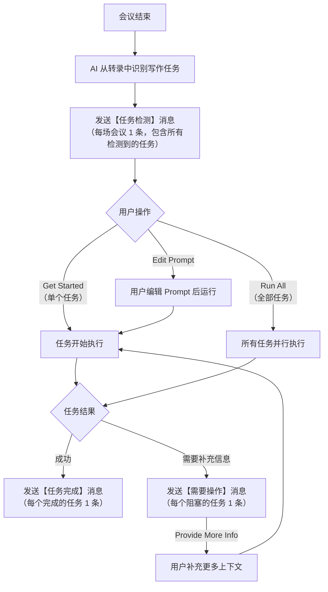

# Writing Tasks — Chat Notification 产品需求文档

> **负责人：** 产品团队
> **最后更新：** 2026-04-22
> **状态：** 待研发评审

---

## 目录

1. [概述](#1-概述)
2. [消息生命周期流程](#2-消息生命周期流程)
3. [消息通用结构](#3-消息通用结构)
4. [三类消息详细规格](#4-三类消息详细规格)
5. [视觉标识系统](#5-视觉标识系统)
6. [交互与跳转逻辑](#6-交互与跳转逻辑)
7. [消息发送规则](#7-消息发送规则)
8. [技术约束](#8-技术约束)

---

## 1. 概述

### 功能目标

当一场 Zoom 会议结束后，Writing Tasks 会自动从会议转录中识别后续的写作任务（例如"发一条 Sprint 更新""给利益相关者发邮件"等），并主动通过 **Zoom Team Chat** 向用户发送通知。

用户在 Chat 界面内即可完成全部操作流程 —— 查看已识别的任务、触发执行、查看结果、以及在需要时补充信息。

### Bot 身份信息

| 属性 | 值 |
|---|---|
| 发送者名称 | Writing Tasks |
| 标识徽章 | `APP` |
| 头像 | Writing Tasks 功能 icon |
| 消息格式 | Zoom Chat Markdown + 操作按钮 |

### 支持的任务类型

| 类型 | 说明 | 示例 |
|---|---|---|
| `message` | 发送至频道或个人的 Chat 消息 | 向 #engineering 发布 Sprint 更新 |
| `email` | 发送给指定收件人的邮件 | 给利益相关者发跟进邮件 |
| `doc_create` | 创建新文档 | 创建一份 PRD |
| `doc_update` | 更新已有文档 | 更新设计规范文档 |
| `multi_output` | 单个任务生成多个交付物 | Q1 业务回顾包（幻灯片 + 表格 + 数据表） |

---

## 2. 消息生命周期流程

### 三类消息

系统发送的所有消息分为 **三个类别**，每个类别对应任务生命周期中的一个阶段：

| 类别 | 标题格式 | 触发条件 | 发送频率 |
|---|---|---|---|
| **任务检测** | `✨ {N} new writing tasks are ready to go` | 一场含后续写作任务的会议结束 | 每场会议 1 条 |
| **任务完成** | `✅ Task done: {任务标题}` | 某个任务完成产出生成 | 每个完成的任务 1 条 |
| **需要操作** | `⚠️ Action needed: {任务标题}` | 某个任务因缺少用户输入无法继续 | 每个阻塞的任务 1 条 |

### 生命周期流程图



---

## 3. 消息通用结构

每条 Bot 消息（无论属于哪个类别）都遵循以下统一结构：

```
┌── Bot 头像 ────┬── 发送者信息栏 ──────────────────────────┐
│  [WT 图标]     │  Writing Tasks  [APP]  {时间戳}          │
│                ├───────────────────────────────────────────┤
│                │  ┌─ 消息卡片 ─────────────────────────┐   │
│                │  │  {标题行}                          │   │
│                │  │  {正文内容 — 因消息类别而异}        │   │
│                │  │  ─────────────────────────────     │   │
│                │  │  {操作栏 — 按钮}                   │   │
│                │  └────────────────────────────────────┘   │
└────────────────┴───────────────────────────────────────────┘
```

### 组成部分

| 组件 | 说明 |
|---|---|
| **Bot 头像** | Writing Tasks 功能 icon。每条消息左侧显示一次。 |
| **发送者信息栏** | `Writing Tasks`（加粗）+ `APP` 徽章 + 时间戳。位于卡片上方。 |
| **消息卡片** | 白色背景、圆角、灰色细边框。包含所有内容。 |
| **标题行** | 加粗文字 + 状态 emoji。卡片内第一行。 |
| **正文内容** | 因消息类别而异（详见第 4 节）。可能包含 @提及、引用块、列表、链接。 |
| **操作栏** | 与正文之间以细线分隔。包含 1-2 个操作按钮。 |

### 所有消息共有的规则

- 每条消息正文中都包含 `@{用户名}` 提及，确保触发通知。
- 标题行始终以状态 emoji 开头（✨ / ✅ / ⚠️）。

---

## 4. 三类消息详细规格

### 4.1 任务检测消息

**触发条件：** 一场会议结束，AI 从转录中识别出后续写作任务。

**发送频率：** 每场会议 1 条。同一场会议的所有任务归入同一条消息中。

#### 消息结构

```
┌─────────────────────────────────────────────────────────────────┐
│ ✨ {N} new writing tasks are ready to go        ← 标题          │
│                                                                 │
│ @{用户名} — Writing tasks from **{会议名称}**                    │
│   | {开始时间}–{结束时间} · Hosted by {主持人}   ← 上下文信息    │
│                                                                 │
│ ─ ─ ─ ─ ─ ─ ─ ─ ─ ─ ─ ─ ─ ─ ─ ─ ─ ─ ─ ─ ─ ─ ─ ─            │
│ **1. {任务标题}**                               ← 任务          │
│ {AI 自动生成的 Prompt}                          ← Prompt        │
│ Get Started | Edit Prompt                       ← 操作链接      │
│ ─ ─ ─ ─ ─ ─ ─ ─ ─ ─ ─ ─ ─ ─ ─ ─ ─ ─ ─ ─ ─ ─ ─ ─            │
│ **2. {任务标题}**                                               │
│ {AI 自动生成的 Prompt}                                          │
│ Get Started | Edit Prompt                                       │
│ ─ ─ ─ ─ ─ ─ ─ ─ ─ ─ ─ ─ ─ ─ ─ ─ ─ ─ ─ ─ ─ ─ ─ ─            │
│ ...每个任务重复以上结构...                                       │
│ ═══════════════════════════════════════════════════════          │
│ [Run All]  [View in Writing Tasks]              ← 操作栏        │
└─────────────────────────────────────────────────────────────────┘
```

#### 各板块说明

| 板块 | 格式 | 说明 |
|---|---|---|
| 标题 | `✨ {N} new writing tasks are ready to go`（加粗） | N = 检测到的任务数量 |
| 上下文行 | `@{用户} — Writing tasks from **{会议名称}** | {时间段} · Hosted by {主持人}` | @mention 为 Zoom Chat 可点击的用户提及 |
| 任务列表 | 编号列表，任务之间以细线分隔 | 每个任务一条 |
| 任务条目 — 标题 | `{序号}. {任务标题}`（加粗） | 从会议转录中提取的任务名称 |
| 任务条目 — Prompt | `{AI 生成的 Prompt}`（浅色文字） | AI 自动生成的写作指令，描述具体要写什么 |
| 任务条目 — 操作链接 | `Get Started`（蓝色链接）`|` `Edit Prompt`（灰色链接） | 行内文字链接，用竖杠分隔 |
| 操作栏 | `[Run All]` 主按钮、`[View in Writing Tasks]` 次按钮 | 与任务列表之间以分割线分隔 |

#### 示例

```
✨ 4 new writing tasks are ready to go

@Alex Chen — Writing tasks from Sprint Planning | 9:00–10:00 · Hosted by Sarah Chen

1. Post sprint update to #engineering channel
   Share a brief sprint update covering auth module progress, dashboard PR
   status, and notification redesign deprioritization with the team.
   Get Started | Edit Prompt

2. Send follow-up email to stakeholders
   Draft a stakeholder update email covering Q1 review highlights, revenue
   growth, customer retention, and new enterprise accounts onboarded.
   Get Started | Edit Prompt

3. Update design specifications based on team review
   Update the design specs document to include the new 12-column grid layout,
   revised button radius, and accessibility guidelines from team feedback.
   Get Started | Edit Prompt

4. Share meeting recap with attendees
   Summarize the key discussion points, decisions, and action items from the
   sprint planning meeting and share with all attendees.
   Get Started | Edit Prompt

───────────────────────
[Run All]  [View in Writing Tasks]
```

---

### 4.2 任务完成消息

**触发条件：** 一个任务成功完成并生成了产出。

**发送频率：** 每个完成的任务单独发送 1 条。

**核心结构：** 所有任务完成消息共享同一基础结构，但根据**任务的产出类型**不同，正文内容有所差异。

#### 基础结构（所有产出类型共有）

```
┌─────────────────────────────────────────────────────────────────┐
│ ✅ Task done: {任务标题}                         ← 标题         │
│                                                                 │
│ @{用户} — {固定句式介绍语}                       ← 介绍语       │
│                                                                 │
│ ┃ {产出内容预览 — 因产出类型而异}          ← 绿色左竖线引用块   │
│                                                                 │
│ ═══════════════════════════════════════════════════════          │
│ [View Result]                                    ← 操作栏       │
└─────────────────────────────────────────────────────────────────┘
```

| 板块 | 格式 | 说明 |
|---|---|---|
| 标题 | `✅ Task done: {任务标题}`（加粗） | 所有产出类型共用此格式 |
| 介绍语 | 固定句式，按任务类型选词（见下方分类说明） | 任务名称已在标题行展示，介绍语仅包含目标标识符和数字 |
| 产出预览 | 绿色左竖线引用块，内容因产出类型而异 | 展示生成结果 |
| 操作栏 | `[View Result]` 按钮 | 所有产出类型共用 |

#### 介绍语设计原则

介绍语采用**固定句式**，不嵌入任务名称或描述（任务名称已在标题行 `Task done: {title}` 中展示）。根据任务类型选用对应名词（message / email / document / deliverables），仅**目标标识符**（频道名 / 邮箱地址）和**数字**为变量。

#### 按产出类型分类说明

---

##### (a) Chat 消息（有指定频道）

适用于：任务类型为 `message`，且有明确的目标频道。

| 板块 | 内容 |
|---|---|
| 介绍语 | `@{用户} — Your message for **#{频道名}** has been prepared:` |
| 产出预览 | 绿色引用块中展示完整的生成消息文本 |

示例：

```
✅ Task done: Post sprint update

@Alex Chen — Your message for #engineering has been prepared:

┃ Hi team, quick sprint update:
┃ • Auth module: Core logic complete, PR #127 under review
┃ • Dashboard: Interactive charts merged, performance tests passing
┃ • Notification redesign: Deprioritized to next sprint
┃ Let me know if any questions!

───────────────────────
[View Result]
```

---

##### (b) 邮件

适用于：任务类型为 `email`。

| 板块 | 内容 |
|---|---|
| 介绍语 | `@{用户} — Your email to **{收件人邮箱}** has been prepared:` |
| 产出预览 | 绿色引用块中展示完整邮件内容（主题行、称呼、正文、落款） |

示例：

```
✅ Task done: Stakeholder follow-up email

@Alex Chen — Your email to sarah.chen@company.com has been prepared:

┃ Hi Sarah,
┃
┃ Thanks for joining today's Q1 review. Here's a quick recap:
┃ • Revenue grew 18% QoQ, exceeding our target by 3%
┃ • Customer retention improved to 94.2%
┃ • Three new enterprise accounts onboarded
┃
┃ Next steps: Department leads, please share your Q2 OKRs by Friday.
┃
┃ Best,
┃ Alex

───────────────────────
[View Result]
```

---

##### (c) 文档更新

适用于：任务类型为 `doc_update`。

此类型与其他产出类型的差异较大：在引用块之前额外展示**变更摘要**，引用块内展示的是**文档链接**而非文本预览。

| 板块 | 内容 |
|---|---|
| 介绍语 | `@{用户} — Your document has been updated with {N} changes:` |
| 变更摘要 | 编号纯文本列表（引用块外），最多 3 条。格式：`{序号}. **{章节名}** — {变更详情}` |
| 产出预览 | 绿色引用块中展示 `{文档icon} {文档名称}` 为可点击的蓝色超链接 |

示例：

```
✅ Task done: Design specifications updated

@Alex Chen — Your document has been updated with 3 changes:

1. Grid Layout — Updated to 12-column grid system
2. Button Radius — Revised from 4px to 8px globally
3. Accessibility — Added ARIA label guidelines

┃ 📄 Design Specifications — Q1 Update

───────────────────────
[View Result]
```

---

##### (d) 文档创建

适用于：任务类型为 `doc_create`。

| 板块 | 内容 |
|---|---|
| 介绍语 | `@{用户} — Your document has been created:` |
| 产出预览 | 绿色引用块中展示 `{文档icon} {文档名称}` 为可点击的蓝色超链接 |

示例：

```
✅ Task done: Create Q2 product roadmap PRD

@Alex Chen — Your document has been created:

┃ 📄 Q2 Product Roadmap PRD

───────────────────────
[View Result]
```

---

##### (e) 通用消息（无指定收件人/频道）

适用于：任务类型为 `message`，但没有指定具体的频道或收件人。

| 板块 | 内容 |
|---|---|
| 介绍语 | `@{用户} — Your message has been prepared:` |
| 产出预览 | 绿色引用块中展示完整的生成文本 |

示例：

```
✅ Task done: Meeting recap

@Alex Chen — Your message has been prepared:

┃ Sprint Planning Meeting — Key Takeaways
┃ • Auth module core logic complete, PR under review
┃ • Dashboard interactive charts merged
┃ • Notification redesign deprioritized to next sprint
┃ • Action items assigned to Sarah, Mike, and Lisa

───────────────────────
[View Result]
```

---

##### (f) 多产出任务

适用于：任务类型为 `multi_output`，一个任务生成了多个交付物。

| 板块 | 内容 |
|---|---|
| 介绍语 | `@{用户} — Your deliverables are ready. {N} files included:` |
| 产出预览 | 绿色引用块中逐行展示每个交付物：`{文件类型icon} {文件名}` 为可点击的蓝色超链接 |

示例：

```
✅ Task done: Q1 business review package

@Alex Chen — Your deliverables are ready. 3 files included:

┃ 📊 Q1 Business Review Deck
┃ 📋 Q1 Revenue & Metrics Breakdown
┃ 📑 Customer Retention Data Table

───────────────────────
[View Result]
```

---

#### 介绍语汇总表

| 任务类型 | 固定句式 | 变量部分 |
|---|---|---|
| `message`（有频道） | `Your message for **#{频道}** has been prepared:` | 频道名 |
| `email` | `Your email to **{邮箱}** has been prepared:` | 邮箱地址 |
| `doc_update` | `Your document has been updated with {N} changes:` | 变更数量 |
| `doc_create` | `Your document has been created:` | 无 |
| `message`（无收件人） | `Your message has been prepared:` | 无 |
| `multi_output` | `Your deliverables are ready. {N} files included:` | 文件数量 |

---

### 4.3 需要操作消息

**触发条件：** AI 因缺少用户补充的上下文信息，无法继续处理某个任务。

**发送频率：** 每个被阻塞的任务单独发送 1 条。

#### 消息结构

```
┌─────────────────────────────────────────────────────────────────┐
│ ⚠️ Action needed: {任务标题}                      ← 标题        │
│                                                                 │
│ @{用户} — This task needs more input before       ← 介绍语      │
│   I can get started:                                            │
│                                                                 │
│ ┃ 1. {问题 1}                              ← 琥珀色左竖线引用块│
│ ┃ 2. {问题 2}                                                  │
│ ┃ 3. {问题 3}                                                  │
│                                                                 │
│ ═══════════════════════════════════════════════════════          │
│ [Provide More Info]                              ← 操作栏       │
└─────────────────────────────────────────────────────────────────┘
```

#### 各板块说明

| 板块 | 格式 | 说明 |
|---|---|---|
| 标题 | `⚠️ Action needed: {任务标题}`（加粗） | 直接在标题中展示任务名称，让用户一眼识别是哪个任务 |
| 介绍语 | `@{用户} — This task needs more input before I can get started:` | |
| 问题列表 | 琥珀色（amber）左竖线引用块，内含编号问题列表 | AI 生成的需要用户回答的澄清问题 |
| 操作栏 | `[Provide More Info]` 主按钮 | |

**设计说明：** 标题直接包含任务名称（`Action needed: {任务标题}`），让用户一眼就能识别是哪个任务需要关注，无需再单独展示会议信息和任务名称行，保持消息简洁。

#### 示例

```
⚠️ Action needed: Share Q2 product roadmap summary with leadership

@Alex Chen — This task needs more input before I can get started:

┃ 1. Which specific product areas should the roadmap cover?
┃ 2. Should this include timeline estimates or just feature descriptions?
┃ 3. Is there a preferred format (bullet points, narrative, or table)?

───────────────────────
[Provide More Info]
```

---

## 5. 视觉标识系统

### 左竖线颜色（引用块边框）

| 颜色 | 含义 | 使用场景 |
|---|---|---|
| **绿色** (`#22c55e`) | 任务成功完成 | 所有"任务完成"消息中的产出内容与文件链接 |
| **琥珀色** (`#fbbf24`) | 需要关注 / 需要操作 | "需要操作"消息中的问题列表 |
| _（无竖线）_ | 信息性 / 尚未开始 | "任务检测"消息中的任务列表使用平铺布局，无引用块 |

### 状态 Emoji

| Emoji | 含义 | 使用场景 |
|---|---|---|
| ✨ | 新任务已就绪 | "任务检测"消息标题 |
| ✅ | 任务已完成 | "任务完成"消息标题（`Task done:`） |
| ⚠️ | 需要关注 / 需要操作 | "需要操作"消息标题（`Action needed:`） |

---

## 6. 交互与跳转逻辑

### 6.1 Get Started（开始执行）

- **出现位置：** "任务检测"消息中，每个任务的行内链接
- **交互行为：**
  1. 从 Chat 标签页跳转到 **Writing Tasks** 标签页。
  2. 定位并打开该任务的 **Chat Panel**（任务级对话界面）。
  3. **自动触发任务执行** —— 任务立即开始运行，无需用户进一步操作。
  4. 任务卡片转为 "Running" 状态。

### 6.2 Edit Prompt（编辑 Prompt）

- **出现位置：** "任务检测"消息中，每个任务的行内链接
- **交互行为：**
  1. 从 Chat 标签页跳转到 **Writing Tasks** 标签页。
  2. 定位并打开该任务的 **Chat Panel**。
  3. **将 AI 生成的 Prompt 预填到输入框中**。
  4. **不自动运行。** 用户可以查看、修改或补充 Prompt，然后手动发送。
  5. 这让用户可以在执行前添加上下文、调整指令内容或更改语气。

### 6.3 Run All（一键运行全部）

- **出现位置：** "任务检测"消息中，底部操作栏
- **交互行为：**
  1. **同时触发该会议所有任务的执行**。
  2. 从 Chat 标签页跳转到 **Writing Tasks** 标签页。
  3. 显示该会议的所有任务卡片，每个卡片展示 **"Running"** 状态。
  4. 各任务独立完成后，对应的卡片更新为显示结果。

### 6.4 View in Writing Tasks（在 Writing Tasks 中查看）

- **出现位置：** "任务检测"消息中，底部操作栏
- **交互行为：**
  1. 从 Chat 标签页跳转到 **Writing Tasks** 标签页。
  2. 滚动或筛选，定位到**该场会议关联的任务**。
  3. 不触发任何任务执行 —— 纯导航操作。

### 6.5 View Result（查看结果）

- **出现位置：** 所有"任务完成"消息中的操作栏
- **交互行为：**
  1. 从 Chat 标签页跳转到 **Writing Tasks** 标签页。
  2. 打开该已完成任务的 **Chat Panel**。
  3. 在对话视图中展示生成的产出，用户可以：
     - 查看完整产出
     - 提供额外指令以优化或重新生成
     - 复制或转发产出内容

### 6.6 Provide More Info（提供更多信息）

- **出现位置：** "需要操作"消息中的操作栏
- **交互行为：**
  1. 从 Chat 标签页跳转到 **Writing Tasks** 标签页。
  2. 打开该被阻塞任务的 **Chat Panel**。
  3. 在对话上下文中展示澄清问题。
  4. **输入框自动聚焦**，用户可以立即开始输入回答。
  5. 用户提供回答并发送后，任务恢复执行。

### 6.7 可点击的文档 / 文件链接

- **出现位置：** "任务完成"消息中的文档更新、文档创建和多产出类型
- **交互行为：**
  1. 在 **应用内文档查看器** 或新浏览器标签页中打开文档/文件。
  2. 这是直接打开操作 —— 不会跳转到 Writing Tasks 界面。

### 交互总览表

| 按钮 / 链接 | 所在消息类别 | 跳转目标 |
|---|---|---|
| Get Started | 任务检测（每个任务） | Writing Tasks > 任务 Chat Panel |
| Edit Prompt | 任务检测（每个任务） | Writing Tasks > 任务 Chat Panel（Prompt 预填） |
| Run All | 任务检测（底部） | Writing Tasks > 定位到该会议任务列表 |
| View in Writing Tasks | 任务检测（底部） | Writing Tasks > 定位到该会议任务列表 |
| View Result | 任务完成（底部） | Writing Tasks > 任务 Chat Panel（显示产出） |
| Provide More Info | 需要操作（底部） | Writing Tasks > 任务 Chat Panel |
| 文档/文件链接 | 任务完成 — 文档类、多产出（行内） | 应用内查看器或新标签页 |

---

## 7. 消息发送规则

### 分组规则

- **每场会议 1 条"任务检测"消息。** 同一场会议检测到的所有任务归入一条通知消息。例如一场会议产生 4 个任务，用户收到 1 条消息，列出全部 4 个任务。
- **每个已完成/被阻塞的任务 1 条消息。** 每个任务完成或被阻塞时，独立发送一条对应类别的消息。如果触发了 4 个任务，用户最多收到 4 条独立的完成/操作消息，随各任务事件发生时逐一发送。

### 发送顺序

- "任务检测"消息始终是最先发送的（会议结束后）。
- "任务完成"和"需要操作"消息随任务状态变化**实时发送**。它们不会被批量合并 —— 每条消息在对应事件发生后立即下发。
- 消息在 Chat 流中按**时间顺序**排列。

### @提及规则

- 每条 Bot 消息在正文中都包含 `@{用户名}` 提及（不仅仅在标题中）。
- 这确保消息出现在用户的"提及"列表中，并触发通知。

### 跨会议行为

- 如果用户有连续两场会议，且都产生了写作任务，每场会议会生成各自独立的"任务检测"消息。
- "需要操作"消息通过标题中的任务名称（`Action needed: {任务标题}`）帮助用户快速定位需要关注的任务。

---

## 8. 技术约束

### Zoom Chat Markdown 渲染

所有消息内容必须能被 Zoom Chat 的 Markdown 引擎正确渲染。支持的基本元素如下：

| 元素 | Markdown 语法 | 用途 |
|---|---|---|
| 加粗文字 | `**文本**` | 标题、任务名称、会议名称 |
| @提及 | `@{用户名}` | 正文开头的用户提及 |
| 引用块 | `>`（渲染为左竖线块） | 产出预览、问题列表、文件链接 |
| 编号列表 | `1. 条目` | 变更摘要、问题列表、任务列表 |
| 行内链接 | `[文本](url)` | 文档名称、文件名称 |
| 操作按钮 | Bot API 按钮附件 | Run All、View Result、Provide More Info 等 |

### 按钮类型

Zoom Chat Bot 消息支持两种交互元素：

1. **行内文字链接** —— 渲染为消息正文中带下划线的蓝色文字（如 `Get Started | Edit Prompt`）。本质是标准 Markdown 链接。
2. **操作按钮** —— 渲染为消息内容下方的样式化按钮（如 `[Run All]`、`[View Result]`）。这些是 Bot API 的按钮附件，显示在操作栏区域。

---

## 9. 终极版本完整需求表

> 以下为终极版本（Full Version）的完整功能需求清单，涵盖所有目标能力。Markdown 简化版仅实现其中标注为"简化版也支持"的子集。

### 9.1 消息结构与文案需求

| 需求编号 | 消息类别 | 需求描述 | 简化版 | 终极版 |
|---|---|---|:---:|:---:|
| T-01 | 任务检测 | 标题行：`✨ {N} new writing tasks are ready to go`（加粗） | ✅ | ✅ |
| T-02 | 任务检测 | 上下文行：`@{用户} — Writing tasks from **{会议名}** \| {时间段} · Hosted by {主持人}` | ✅ | ✅ |
| T-03 | 任务检测 | 每个任务展示：序号 + 加粗标题 + AI Prompt（浅色） + 操作链接 | ✅ | ✅ |
| T-04 | 任务检测 | 操作链接：`Get Started`（蓝色）`\|` `Edit Prompt`（灰色），行内文字链接 | ✅ | ✅ |
| T-05 | 任务检测 | 底部操作栏：`[Run All]` 主按钮 + `[View in Writing Tasks]` 次按钮 | ✅ | ✅ |
| T-06 | 任务检测 | 任务列表之间以细线分隔 | ✅ | ✅ |
| T-07 | 任务完成 | 标题行：`✅ Task done: {任务标题}`（加粗） | ✅ | ✅ |
| T-08 | 任务完成 | 介绍语采用固定句式（按类型选词：message / email / document / deliverables） | ✅ | ✅ |
| T-09 | 任务完成 | 产出预览展示在绿色左竖线引用块内 | ✅ | ✅ |
| T-10 | 任务完成 | 底部操作栏：`[View Result]` 按钮 | ✅ | ✅ |
| T-11 | 需要操作 | 标题行：`⚠️ Action needed: {任务标题}`（加粗） | ✅ | ✅ |
| T-12 | 需要操作 | 介绍语：`@{用户} — This task needs more input before I can get started:` | ✅ | ✅ |
| T-13 | 需要操作 | 问题列表展示在琥珀色左竖线引用块内 | ✅ | ✅ |
| T-14 | 需要操作 | 底部操作栏：`[Provide More Info]` 主按钮 | ✅ | ✅ |
| T-15 | 通用 | 每条消息包含 `@{用户名}` 提及 | ✅ | ✅ |
| T-16 | 通用 | 每条消息由 Bot 头像 + 发送者信息栏 + 消息卡片组成 | ✅ | ✅ |

### 9.2 富交互功能（终极版独有）

| 需求编号 | 功能模块 | 需求描述 | 简化版 | 终极版 |
|---|---|---|:---:|:---:|
| R-01 | 任务检测卡片 | 会议信息外壳卡片（圆角边框 + 灰底头部），展示会议全名和时间 | — | ✅ |
| R-02 | 任务检测卡片 | 每个任务可展开/收起（chevron toggle） | — | ✅ |
| R-03 | 任务检测卡片 | 展开后显示「Prompt to be sent」（AI 生成的写作指令，蓝色底框） | — | ✅ |
| R-04 | 任务检测卡片 | 展开后显示「Where this task came from」（会议转录片段） | — | ✅ |
| R-05 | 任务检测卡片 | Prompt 区域底部提供 `Edit Prompt` 行内链接 | — | ✅ |
| R-06 | 任务检测卡片 | 每个任务右侧提供 `Get Started` 按钮（带 AI 图标） | — | ✅ |
| R-07 | Run All 状态 | 点击 Run All 后：`Run All` → 旋转 loading `Running…` → 按钮消失 | — | ✅ |
| R-08 | Run All 状态 | Loading 结束后所有任务卡片右侧按钮变为 `View result`（绿色勾 + 灰底胶囊） | — | ✅ |
| R-09 | 任务完成卡片 | 卡片结构：类型图标 + 任务标题 + `View result` 按钮（卡片头部） | — | ✅ |
| R-10 | 任务完成卡片 | 消息/邮件类型：卡片内展示生成内容预览（灰底圆角文本框，最高 180px 可滚动） | — | ✅ |
| R-11 | 任务完成卡片 | 消息/邮件类型：卡片底部操作栏提供 `Copy` 按钮（点击后变绿色 `Copied`，2s 恢复） | — | ✅ |
| R-12 | 跳转操作 — Chat | `message` + 有目标频道：底部操作栏展示 `Jump to #{频道名}` 按钮，点击跳转到对应频道并预填消息 | — | ✅ |
| R-13 | 跳转操作 — Email | `email` 类型：底部操作栏展示 `Jump to Email` 按钮，点击打开邮件编辑器预览 | — | ✅ |
| R-14 | 跳转操作 — 选择收件人 | `message` + 无目标频道/收件人：底部操作栏展示 `Choose recipient to jump` 按钮 | — | ✅ |
| R-15 | 联系人选择弹窗 | 点击 `Choose recipient to jump` 后弹出联系人选择浮层 | — | ✅ |
| R-16 | 联系人选择弹窗 | 浮层包含搜索框 + 联系人/频道列表（头像 + 名称 + 类型标识） | — | ✅ |
| R-17 | 联系人选择弹窗 | 选择联系人后跳转到对应聊天并预填消息 | — | ✅ |
| R-18 | 邮件编辑器 | Gmail 风格邮件编辑器：主题行 + To 字段 + Cc/Bcc + 正文 + 格式工具栏 + Send 按钮 | — | ✅ |
| R-19 | 邮件编辑器 | 邮件正文预填 AI 生成的邮件内容 | — | ✅ |
| R-20 | 邮件编辑器 | 顶部提供返回 Chat 的按钮 | — | ✅ |
| R-21 | 文档更新卡片 | 卡片头部：文档图标 + 任务标题 + `View result` 按钮 | — | ✅ |
| R-22 | 文档更新卡片 | 卡片内展示文档行：蓝色文档图标 + 文档名称 + `Open document` 按钮（蓝色外链图标） | — | ✅ |
| R-23 | 多产出卡片 | 卡片头部：包裹图标 + 任务标题 + `View result` 按钮 | — | ✅ |
| R-24 | 多产出卡片 | 每个产出文件独立一行：彩色文件图标 + 文件名 + 对应颜色的 `Open {类型}` 按钮 | — | ✅ |
| R-25 | 多产出卡片 | 支持的文件类型及颜色：Slides（橙色）、Sheets（绿色）、Data Table（紫色） | — | ✅ |
| R-26 | 需要操作卡片 | 会议信息外壳卡片（与任务检测卡片同款式） | — | ✅ |
| R-27 | 需要操作卡片 | 卡片内：任务图标 + 任务标题 + `Provide More Info` 按钮（带暂停图标 + 琥珀色） | — | ✅ |

### 9.3 交互跳转逻辑需求

| 需求编号 | 交互入口 | 行为描述 | 简化版 | 终极版 |
|---|---|---|:---:|:---:|
| I-01 | Get Started（行内链接） | 跳转到 Writing Tasks > 该任务 Chat Panel → 自动运行任务 | ✅ | ✅ |
| I-02 | Edit Prompt（行内链接） | 跳转到 Writing Tasks > 该任务 Chat Panel → Prompt 预填到输入框，不自动运行 | ✅ | ✅ |
| I-03 | Run All（操作按钮） | 并行触发所有任务执行 → 跳转到 Writing Tasks 展示所有卡片 Running 状态 | ✅ | ✅ |
| I-04 | Run All 状态流转 | `[Run All]` → `Running…`（旋转 loading） → 按钮消失 | 不适用 | ✅ |
| I-05 | View in Writing Tasks（操作按钮） | 跳转到 Writing Tasks → 定位到该会议任务列表，不执行任务 | ✅ | ✅ |
| I-06 | View Result（操作按钮） | 跳转到 Writing Tasks > 已完成任务 Chat Panel → 展示产出 | ✅ | ✅ |
| I-07 | Provide More Info（操作按钮） | 跳转到 Writing Tasks > 被阻塞任务 Chat Panel → 输入框聚焦 | ✅ | ✅ |
| I-08 | Jump to #{频道}（操作按钮） | 跳转到对应 Chat 频道 → 消息预填到输入框 | — | ✅ |
| I-09 | Jump to Email（操作按钮） | 打开邮件编辑器 → 内容预填 | — | ✅ |
| I-10 | Choose recipient to jump（操作按钮） | 弹出联系人选择浮层 → 选择后跳转到对应聊天并预填消息 | — | ✅ |
| I-11 | Open document（行内按钮） | 在应用内文档查看器或新标签页打开文档 | ✅ (链接) | ✅ (按钮) |
| I-12 | Open Slides / Sheets / Data Table（行内按钮） | 在应用内查看器或新标签页打开对应文件 | ✅ (链接) | ✅ (按钮) |
| I-13 | Copy（卡片内按钮） | 复制生成的消息/邮件内容到剪贴板 → 按钮变为绿色 `Copied`（2s 恢复） | — | ✅ |

### 9.4 消息发送规则需求

| 需求编号 | 规则 | 说明 |
|---|---|---|
| S-01 | 每场会议 1 条"任务检测"消息 | 同一场会议的所有任务归入一条消息 |
| S-02 | 每个完成/阻塞的任务单独 1 条消息 | 任务完成和需要操作消息独立发送 |
| S-03 | 消息按时间顺序排列 | 任务检测消息最先，完成/操作消息实时下发 |
| S-04 | @提及触发通知 | 每条消息正文中包含 `@{用户名}` |
| S-05 | 跨会议独立消息 | 不同会议的任务检测消息各自独立 |

### 9.5 视觉与样式需求

| 需求编号 | 元素 | 说明 | 简化版 | 终极版 |
|---|---|---|:---:|:---:|
| V-01 | 绿色左竖线 (`#22c55e`) | 用于所有"任务完成"消息的产出预览引用块 | ✅ | ✅ |
| V-02 | 琥珀色左竖线 (`#fbbf24`) | 用于"需要操作"消息的问题列表引用块 | ✅ | ✅ |
| V-03 | 消息卡片样式 | 白色背景 + 圆角 + 灰色细边框 + 阴影 | 简化 | ✅ |
| V-04 | 会议信息外壳 | 灰底头部 + 会议全名 + 时间 + 主持人 | — | ✅ |
| V-05 | 任务状态图标 | 类型图标（消息/邮件/文档）+ 绿底圆角方块 | — | ✅ |
| V-06 | View result 胶囊 | 绿色勾 + 灰底圆角胶囊样式 | — | ✅ |
| V-07 | 文件行彩色图标 | Slides 橙色、Sheets 绿色、Data Table 紫色、Doc 蓝色 | — | ✅ |
| V-08 | Bot 头像 | 蓝色渐变圆角方形，内含灯泡 SVG 图标 | ✅ | ✅ |
| V-09 | 状态 Emoji | ✨ 任务检测 / ✅ 任务完成 / ⚠️ 需要操作 | ✅ | ✅ |
